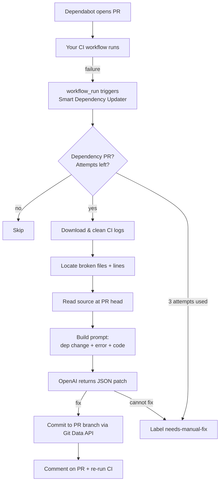

# 🤖 Smart Dependency Updater

**AI-powered remediation bot for dependency-update pull requests.**

When Dependabot or Renovate bumps a library and your CI turns red because the
new version changed its API, Smart Dependency Updater reads the failing CI
logs, asks an LLM to refactor the broken code, and **pushes the fix straight
into the pull request** — then lets CI run again. No more babysitting
"breaking change" PRs.

[](https://github.com/mrdil07/Smart-Dependency-Updater/actions/workflows/ci.yml)
[](LICENSE)
[](https://github.com/marketplace/actions/smart-dependency-updater)

---

## ✨ What it does

A normal dependency bump that breaks an API leaves you with a red PR and a
manual fix. This action automates the fix:

1. **Listens** for a failed CI run on a Dependabot/Renovate PR.
2. **Reads** the failing CI logs through the GitHub API and pinpoints the files
   and lines that broke.
3. **Understands** which dependency changed, and from which version to which.
4. **Asks an LLM** (OpenAI) to adapt the old code to the new API — returning
   only the files that need to change.
5. **Commits** the fix back into the same PR and leaves an explanatory comment.
6. **Re-runs** CI automatically. Green ✅ → ready to merge.

If it can't fix the failure — or three attempts in a row still fail — it stops,
labels the PR `needs-manual-fix`, and asks a human to take over.

## 🔄 How it works



## 🚀 Quick start

You need **two** workflow files in the repository you want to protect.

### 1. Your existing test workflow

Make sure your CI workflow has a `name`. Smart Dependency Updater watches it by
that name. For example `.github/workflows/ci.yml`:

```yaml
name: CI # <-- remember this name

on: [push, pull_request]

jobs:
  test:
    runs-on: ubuntu-latest
    steps:
      - uses: actions/checkout@v4
      - uses: actions/setup-node@v4
        with: { node-version: 20, cache: npm }
      - run: npm ci
      - run: npm test
```

### 2. The remediation workflow

Add `.github/workflows/smart-dependency-updater.yml`:

```yaml
name: Smart Dependency Updater

on:
  workflow_run:
    workflows: ['CI'] # <-- must match the name above
    types: [completed]

permissions:
  contents: write
  pull-requests: write
  actions: read

jobs:
  remediate:
    runs-on: ubuntu-latest
    if: ${{ github.event.workflow_run.conclusion == 'failure' }}
    steps:
      - uses: mrdil07/Smart-Dependency-Updater@v1
        with:
          github-token: ${{ secrets.GITHUB_TOKEN }}
          openai-api-key: ${{ secrets.OPENAI_API_KEY }}
```

### 3. Add your OpenAI key

Go to **Settings → Secrets and variables → Actions → New repository secret** and
add `OPENAI_API_KEY`. That's it — the next time a dependency bump breaks your
build, the bot will try to fix it.

> **Why `workflow_run`?** It is the only trigger that runs with **write**
> permissions in response to a Dependabot PR. Dependabot-triggered workflows
> get a read-only token by design, so pushing a fix from there is impossible.
> `workflow_run` runs in the context of your default branch and sidesteps that
> safely. See [examples/](examples/) for copy-paste files.

## ⚙️ Inputs

| Input                 | Required | Default                              | Description                                                                 |
| --------------------- | :------: | ------------------------------------ | --------------------------------------------------------------------------- |
| `github-token`        |    ✅    | `${{ github.token }}`                | Token used to read logs and write to the PR.                                |
| `openai-api-key`      |    ✅    | —                                    | OpenAI API key. **Store in Secrets — never inline.**                        |
| `openai-model`        |          | `gpt-4o`                             | Chat model used to generate fixes.                                          |
| `openai-base-url`     |          | _(empty)_                            | Custom base URL for an OpenAI-compatible endpoint (Azure, gateway, …).      |
| `max-attempts`        |          | `3`                                  | Max automatic fix commits before giving up.                                 |
| `manual-label`        |          | `needs-manual-fix`                   | Label applied when manual intervention is needed.                           |
| `dependency-authors`  |          | `dependabot[bot],renovate[bot],…`    | Comma-separated PR author logins treated as dependency bots.                |
| `branch-prefixes`     |          | `dependabot/,renovate/,deps/,…`      | Comma-separated branch prefixes treated as dependency PRs (fallback).       |
| `max-files`           |          | `6`                                  | Max source files sent to the model per attempt.                             |
| `pr-number`           |          | _(empty)_                            | Explicit PR to remediate (for manual `workflow_dispatch` runs).             |
| `commit-author-name`  |          | `smart-dependency-updater[bot]`      | Author name for the fix commit.                                             |
| `commit-author-email` |          | `…github-actions[bot]@users…`        | Author email for the fix commit.                                            |
| `dry-run`             |          | `false`                              | Analyze and comment with a proposed fix, but do **not** push a commit.      |

## 📤 Outputs

| Output       | Description                                                                        |
| ------------ | --------------------------------------------------------------------------------- |
| `status`     | `fixed`, `skipped`, `unable-to-fix`, `manual-intervention`, or `no-op`.            |
| `pr-number`  | The PR number that was processed (if any).                                         |
| `commit-sha` | SHA of the fix commit that was pushed (empty if none).                             |
| `attempts`   | Total number of automatic fix attempts recorded on the PR.                         |

## 🔒 Security & constraints

- **Least privilege.** The action only reads CI logs and writes commits and
  comments **inside the PR branch**. It never pushes to `main`/`master`.
- **Secrets stay secret.** Your OpenAI key is read from GitHub Secrets and is
  never written to logs, commits, or comments.
- **Bounded attempts.** After `max-attempts` (default **3**) failed fix commits,
  the bot stops, applies the `needs-manual-fix` label, and comments so a
  maintainer can step in. This prevents infinite commit/CI loops and runaway API
  spend.
- **Dependency-only.** It acts only on PRs from dependency bots (by author or
  branch prefix). Regular PRs are ignored.
- **Dry-run mode.** Set `dry-run: 'true'` to evaluate the bot safely — it will
  comment what it _would_ change without pushing anything.

## 🧩 Supported ecosystems & languages

Dependency detection recognizes **npm, pip, Go modules, Bundler, Maven/Gradle,
Composer, and Cargo** manifests. Error/log parsing and code fixing work for any
language whose CI prints file references (TypeScript/JavaScript, Python, Go,
Java, Ruby, Rust, PHP, and more) — the LLM does the actual refactoring, so it is
not limited to a fixed list.

## 🛠️ Advanced configuration

<details>
<summary>Use a specific model, raise the attempt limit, and customize the label</summary>

```yaml
- uses: mrdil07/Smart-Dependency-Updater@v1
  with:
    github-token: ${{ secrets.GITHUB_TOKEN }}
    openai-api-key: ${{ secrets.OPENAI_API_KEY }}
    openai-model: gpt-4o
    max-attempts: '5'
    manual-label: 'ai-could-not-fix'
    max-files: '8'
```

</details>

<details>
<summary>Run manually against a specific PR (workflow_dispatch)</summary>

```yaml
on:
  workflow_dispatch:
    inputs:
      pr:
        description: PR number to remediate
        required: true

permissions:
  contents: write
  pull-requests: write
  actions: read

jobs:
  remediate:
    runs-on: ubuntu-latest
    steps:
      - uses: mrdil07/Smart-Dependency-Updater@v1
        with:
          github-token: ${{ secrets.GITHUB_TOKEN }}
          openai-api-key: ${{ secrets.OPENAI_API_KEY }}
          pr-number: ${{ inputs.pr }}
```

</details>

<details>
<summary>Use an Azure OpenAI / OpenAI-compatible endpoint</summary>

```yaml
- uses: mrdil07/Smart-Dependency-Updater@v1
  with:
    github-token: ${{ secrets.GITHUB_TOKEN }}
    openai-api-key: ${{ secrets.AZURE_OPENAI_KEY }}
    openai-base-url: https://my-resource.openai.azure.com/openai/deployments/my-deployment
    openai-model: gpt-4o
```

</details>

## ❓ FAQ

**Does it ever touch my main branch?** No. It only ever updates the PR's head
branch via the GitHub Git Data API.

**What if the AI makes it worse?** Every change is a normal commit on the PR, so
CI re-runs and you can review or revert it like any other commit. After
`max-attempts` it stops and asks for a human.

**How much does it cost?** One OpenAI request per fix attempt (capped at
`max-attempts`). The prompt is bounded (focused log excerpt + a handful of
files), so cost per PR is small and predictable.

**Does it work with private repos?** Yes — it uses the repo's `GITHUB_TOKEN`.

**Renovate too?** Yes. Renovate's author/branches are recognized out of the box.

## 🧪 Try the demo

See [`demo/`](demo/) for a tiny, self-contained project with a deliberately
breaking dependency change you can use to watch the bot work end-to-end.

## 👩‍💻 Local development

```bash
npm install
npm run typecheck   # tsc --noEmit
npm test            # jest unit tests
npm run build       # bundle into dist/ with @vercel/ncc
npm run all         # all of the above
```

The compiled bundle in [`dist/`](dist/) is committed on purpose — GitHub runs it
directly. CI fails if `dist/` is out of date, so **run `npm run build` and
commit `dist/` whenever you change `src/`.**

Architecture lives under [`src/`](src/):

| Path                          | Responsibility                                             |
| ----------------------------- | ---------------------------------------------------------- |
| `src/main.ts`                 | Action entry point.                                        |
| `src/config.ts`               | Parse & validate inputs.                                   |
| `src/remediation/`            | The end-to-end orchestration + attempt budget.             |
| `src/github/`                 | Octokit client, logs, PR/dependency detection, commits.    |
| `src/parser/logParser.ts`     | Clean CI logs and extract errors + file references.        |
| `src/ai/`                     | Prompt engineering and the OpenAI call.                    |

## 🤝 Contributing

Issues and PRs are welcome — see [CONTRIBUTING.md](CONTRIBUTING.md).

## 📄 License

[MIT](LICENSE) © mrdil07

---

## 🇺🇿 Qisqacha (Uzbek)

**Smart Dependency Updater** — Dependabot/Renovate yangilagan kutubxona API'si
o'zgarib, CI testlari qizarib qolganda ishga tushadigan sun'iy intellektli bot.
U xato bergan CI loglarini o'qiydi, OpenAI yordamida eskirgan kodni yangi
versiyaga moslab, **to'g'irlangan kodni to'g'ridan-to'g'ri o'sha Pull Request
ichiga commit qiladi** va izoh qoldiradi. So'ng CI qayta ishga tushadi.

Agar bot xatoni tuzata olmasa yoki ketma-ket **3 marta** urinishdan keyin ham
testlar o'tmasa — u to'xtaydi va PR'ga `needs-manual-fix` yorlig'ini qo'yib,
maintainer'ni chaqiradi. `main`/`master` branch'ga hech qachon yozmaydi, API
kalitlari faqat GitHub Secrets'da saqlanadi.

O'rnatish: yuqoridagi **Quick start** bo'limidagi ikkita workflow faylini
qo'shing va `OPENAI_API_KEY` ni Secrets'ga kiriting.
